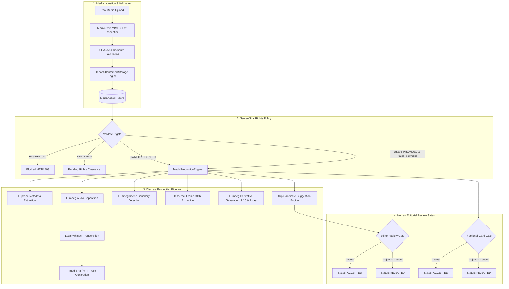

# Phase 5 — Media & Video Production Architecture

## 1. Overview & System Purpose

The **Media & Video Production Subsystem** provides a secure, multi-tenant newsroom media ingestion and preparation infrastructure for News 9 and future broadcast tenants. It automates technical analysis, audio extraction, speech transcription, visual scene boundary detection, on-screen text OCR extraction, timed subtitles generation (SRT & WebVTT), and video derivative formatting (such as 9:16 vertical video and 720p web proxy).

All operations strictly uphold multi-tenant data isolation, rigorous permission controls, rights and copyright validation, safe subprocess isolation, and mandatory human review gates before any asset or candidate moment can be used downstream.

> [!IMPORTANT]
> **Out of Scope Boundary (Phase 6)**:
> This subsystem strictly stops at **editorial readiness within the platform**. Direct publishing to external distribution channels (YouTube, Facebook, Instagram, WhatsApp, website auto-publishing) belongs exclusively to Phase 6.

---

## 2. Subsystem Architecture & Component Topology

---

## 3. Real Media Processing vs. Test Mock Boundary

To maintain production integrity, the subsystem adheres to a strict architectural rule:

1. **Production Providers (`FFmpegMediaProcessor`, `LocalWhisperProvider`, `FFmpegSceneDetector`, `LocalOCRProvider`)**:
   - Verify external binaries via `is_available()`.
   - If external binaries are not present in the host runtime environment, they explicitly raise `ToolUnavailableError`.
   - The job is marked with status `TOOL_UNAVAILABLE` or `FAILED`.
   - **Under no circumstances does production code fabricate fake transcripts, synthetic scene boundaries, or fake derivative files.**
2. **Test-Only Mocks (`MockMediaProcessor`, `MockTranscriptionProvider`, `MockSceneDetector`, `MockOCRProvider`)**:
   - Strictly isolated test fixtures with `IS_MOCK = True`.
   - Used exclusively in automated tests (`pytest`) to verify engine workflows and state transitions deterministically without external binary dependencies.
   - Production API routers instantiate real providers and never allow callers to request mock execution.

---

## 4. Rights & Copyright Policy Matrix

| Rights Type | Description | Derivative Permitted? | Required Action |
|---|---|:---:|---|
| `OWNED` | Original content produced directly by tenant newsroom | **YES** | Proceed directly |
| `LICENSED` | Partner, wire service, or syndicated content | **YES** | Valid license details stored |
| `USER_PROVIDED` | Eyewitness submission, community reporter, or PR | **CONDITIONAL** | Requires `reuse_permitted: True` |
| `RESTRICTED` | Embargoed footage, confidential court feed, internal only | **NO** | Blocked with HTTP 403 |
| `UNKNOWN` | Rights status undetermined at upload time | **NO** | Requires human editorial clearance |

---

## 5. Storage Containment & Streaming Security

- **Path Containment**: All raw uploads and derived assets are stored strictly under `data/tenants/{tenant_id}/media/`. Every read or write operation resolves through `LocalStorageProvider._resolve_tenant_path()`, which rejects any path containing directory traversal attempts (`..`, absolute paths) with a `PermissionError`.
- **Signed Short-Lived Download Tokens**:
  - Direct video streaming URLs use HMAC-SHA256 signed short-lived tokens valid for 15 minutes (900 seconds).
  - The token payload binds `tenant_id`, `media_id`, `user_id`, and `expiration_timestamp`.
  - Attempts to reuse a token across tenants or with mismatched media IDs are rejected with HTTP 403/404.
